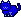
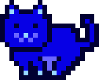
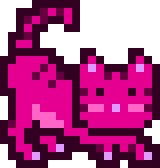
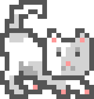

# Do-It-Yourself (DIY) - Yes, You Can! - Mint Your Own MoonCats Off Chain Using Any Of The 128 True Official Genuine Mooncat™ MD5-Verified Original Designs in ~24×24 Pixel Format or With 2X / 4X / 8X Zoom


Let's create a script to mint mooncats.


## Step 1:  Inside the On-Chain 5-Bytes IDs  - Genesis? · Design (Pose / Facing / Face / Fur ) · Inverted Palette? · Red / Green / Blue


Let's start with the on-chain 5-byte ids:
Examples: `0x00000800fa`,
`0x0077c8278d`, and `0xff5f000ca7`.

The first byte (`byte[0]`)
tells you if your cat is one of the 256
possible released genesis cats (`ff`)
or a rescued cat (`00`).

The second byte (`byte[1]`)
holds the design - one of 0
to 127 and the most signifiant bit tells you to invert the color palette or not.

Lastly the third, fourth, and fifth bytes
(`byte[2]`, `byte[3]`, `byte[4]`)
tell you the red (r), green (g), blue (b) color value - from 0 to 255 - that gets used to derive the color palette, that is, all 5 colors.

Note: For the 256 possible released genesis cats the black / white color palette is "hard-coded" 
and NOT derived from the red (r), green (g), blue (b) color value.


Let's decode the 5-byte id - `0x00000800fa`:

``` ruby
require 'mooncats'

meta = Mooncats::Metadata.new( '0x00000800fa' )

## 00 - byte[0]
meta.genesis?      #=> false

## 00 - byte[1]
meta.design.to_i   #=> 0
meta.design.pose   #=> "Standing"
meta.design.facing #=> "Left"
meta.design.face   #=> "Smile"
meta.design.fur    #=> "Solid"
meta.invert?       #=> false

## 08 00 fa - byte[2], byte[3], byte[4]
meta.rgb           #=> [8, 0, 250]
```

Or lets try the 5-byte id - `0x0077c8278d`:

``` ruby
meta = Mooncats::Metadata.new( '0x0077c8278d' )

## 00 - byte[0]
meta.genesis?      #=> false

## 77 - byte[1]
meta.design.to_i   #=> 119
meta.design.pose   #=> "Stalking"
meta.design.facing #=> "Right"
meta.design.face   #=> "Flat Whiskers"
meta.design.fur    #=> "Striped"
meta.invert?       #=> false

## c8 27 8d - byte[2], byte[3], byte[4]
meta.rgb           #=> [200, 39, 141]
```


## Step 2 - Start minting

Note: By default mooncats get saved in the original ~24×24¹ pixel format.

¹: The 4 different pixel formats approaching 24×24 are really -
Standing (21×17), Sleeping (20×14), Pouncing (17×22), Stalking (20×21).


``` ruby

Mooncats::Image.generate( '0x00000800fa' ).save( './mooncat-00000800fa.png' )
Mooncats::Image.generate( '0x0077c8278d' ).save( './mooncat-0077c8278d.png' )
Mooncats::Image.generate( '0xff5f000ca7' ).save( './mooncat-ff5f000ca7.png' )

```

And voila!




Let's change the zoom factor:

``` ruby
# use x2

Mooncats::Image.generate( '0x00000800fa', zoom: 2 ).save( './mooncat-00000800fa_x2.png' )
Mooncats::Image.generate( '0x0077c8278d', zoom: 2 ).save( './mooncat-0077c8278d_x2.png' )
Mooncats::Image.generate( '0xff5f000ca7', zoom: 2 ).save( './mooncat-ff5f000ca7_x2.png' )

# And x4:

Mooncats::Image.generate( '0x00000800fa', zoom: 4 ).save( './mooncat-00000800fa_x4.png' )
Mooncats::Image.generate( '0x0077c8278d', zoom: 4 ).save( './mooncat-0077c8278d_x4.png' )
Mooncats::Image.generate( '0xff5f000ca7', zoom: 4 ).save( './mooncat-ff5f000ca7_x4.png' )

# ...
```

And voila!


And x4:


And x8:





And so on. Happy miniting.


