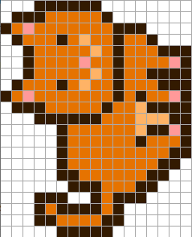

# Inside the 128 True Official Genuine Mooncat™ MD5-Verified Original Designs in ~24×24 Pixel Format - All About Pose / Facing / Face / Fur


You can find all 128 True Official Genuine Mooncat™ MD5-verified
original designs in line #6 in the open source
[`mooncatparser.js`](https://github.com/ponderware/mooncatparser/blob/master/mooncatparser.js#L6) image data generation code.


Aside: What about the MD5-verifed original design crypto "magic"?

> The MD5 message-digest algorithm is a widely used hash function
> producing a 128-bit hash value.
>
> -- [MD5 @ Wikipedia](https://en.wikipedia.org/wiki/MD5)

If you look into the [`MoonCatRescue`](https://github.com/cryptocopycats/contracts/tree/master/mooncats) blockchain contract code -
you can find the comment:

> Use this [MD5 hash] to verify `mooncatparser.js`
> the cat image data generation javascript file.

followed by the 128-bit / 16-byte MD5 hash value in code:

``` solidity
bytes16 public imageGenerationCodeMD5 = 0xdbad5c08ec98bec48490e3c196eec683;
```

Using a command line tool such as `md5sum` you can (re)calculate /
verify the hash:

```
$ md5sum mooncatparser.js
```

resulting in:

```
dbad5c08ec98bec48490e3c196eec683 *mooncatparser.js
```

Bingo! The MD5 hash values match up!
`dbad5c08ec98bec48490e3c196eec683` equals
`dbad5c08ec98bec48490e3c196eec683`.  (Note: `0x` is the optional "dummy" hex prefix that you can drop.)

✓ True Official Genuine Mooncat™ original designs verified.


Or using a "hand-rolled" script
to compute the message digest in hex(adecimal):

``` ruby
require 'crypto'       # or use require 'crypto-lite'

text = File.read( 'mooncatparser.js')
md5( text )
#=> "dbad5c08ec98bec48490e3c196eec683"
```


Onwards.

Back to line #6 in the open source
[`mooncatparser.js`](https://github.com/ponderware/mooncatparser/blob/master/mooncatparser.js#L6) image data generation code:

``` js
var designs = [
  // design 0
  "00011111100000000.01113333310000000.13533333331110000."
  "01333134331331000.00133333431333111.00133335331333351."
  "00133333431331111.01333134331333111.13533333331313351."
  "01113333313341111.00011111133344411.00000133333341151."
  "00000133333313331.00000133333333311.00000133333333110."
  "00000113333331100.00000011133311000.00011100131110000."
  "00013111131000000.00011333311000000.00000111110000000",
  // design 1
  "00000000111100.00011111113110.01113333313310."
  "13533333331310.01333134331510.00133333431110."
  "00133335331510.00133333431310.01333134331310."
  "13533333331111.01113333311331.00011111131131."
  "00011333334131.00013333334131.00013333133131."
  "00011333311331.00001333313311.00001333333110."
  "00001113331100.00000011111000",
  // and so on up to design 127
]
```

The `designs` array holds 128 designs (from 0 to 127)
in four pixel size formats, that is,
21×17 (Standing), 20×14 (Sleeping), 17×22 (Pouncing), 20×21 (Stalking)
and every design
has the pixels encoded in five possible colors (`1`,`2`,`3`,`4`,`5`) and zero (`0`) stands for transparent
and the dot (`.`) breaks up lines.


Let's try the copy-n-pasted designs in [`designs.rb`](https://github.com/cryptocopycats/mooncats/blob/master/lib/mooncats/designs.rb) for easy
(re)use in the mooncats library:

``` ruby
require 'mooncats'

DESIGNS.size
```

printing as expected:

```
#=> 128
```


Let's generate some images using the designs. Let's start with
design #0 and #1:

``` ruby
cat = Mooncats::Image.new( design: DESIGNS[0] )
# or
cat = Mooncats::Image.new( design: 0 )   ## convenience shortcut
cat.save( 'i/design-000.png' )

cat = Mooncats::Image.new( design: DESIGNS[1] )
# or
cat = Mooncats::Image.new( design: 1 )   ## convenience shortcut
cat.save( 'i/design-001.png' )
```

And voila!


Let's try with x3 zoom factor:


``` ruby
cat = Mooncats::Image.new( design: 0, zoom: 3 )
cat.save( 'i/design-000x3.png' )

cat = Mooncats::Image.new( design: 1, zoom: 3 )
cat.save( 'i/design-001x3.png' )
```


You can categorize / tag the designs by pose (4), face (4), fur (4),
and facing (2) attributes, that is, `4 x 4 x 4 x 2 = 128`.

And you can (re)use the pre-defined assigned names:

``` ruby
POSES = [
  'Standing',   # 00
  'Sleeping',   # 01
  'Pouncing',   # 10
  'Stalking',   # 11
]

FACES = [
  'Smile',              # 00
  'Frown (Look Down)',  # 01
  'Frown (Look Up)',    # 10
  'Flat Whiskers',      # 11
]

FURS = [
  'Solid',      # 00
  'Striped',    # 01
  'Eyepatch',   # 10
  'Half/Half',  # 11
]

FACINGS = [
  'Left',   # 0
  'Right',  # 1
]
```

Let's try to automagically describe design 0:

``` ruby
design = Mooncats::Metadata::Design.new( 0 )
design.pose     #=> "Standing"
design.face     #=> "Smile"
design.fur      #=> "Solid"
design.facing   #=> "Left"
```

And design 1:

``` ruby
design = Mooncats::Metadata::Design.new( 1 )
design.pose     #=> "Sleeping"
design.face     #=> "Smile"
design.fur      #=> "Solid"
design.facing   #=> "Left"
```

and so on.


## Bonus: Do-It-Yourself (DIY) - The Original Mooncat Pixel Drawing Tool Online


The Mooncat developers (Ponderware) write:

> Here is the tool we wrote and used to generate the MoonCatRescue pixel art.
> There has been some interest in knowing how we drew them, so we figured we might as well release it.
> Prepare to be underwhelmed!  => [**mooncatrescue.com/pixeleditor**](https://mooncatrescue.com/pixeleditor)


A little tip if you try it out online -
yes, you can read in the design into the pixel drawing tool online  (reformat required - every pixel row must be on its own line
and all (color) numbers space separated). Example for design 0:

```
0 0 0 1 1 1 1 1 1 0 0 0 0 0 0 0 0
0 1 1 1 3 3 3 3 3 1 0 0 0 0 0 0 0
1 3 5 3 3 3 3 3 3 3 1 1 1 0 0 0 0
0 1 3 3 3 1 3 4 3 3 1 3 3 1 0 0 0
0 0 1 3 3 3 3 3 4 3 1 3 3 3 1 1 1
0 0 1 3 3 3 3 5 3 3 1 3 3 3 3 5 1
0 0 1 3 3 3 3 3 4 3 1 3 3 1 1 1 1
0 1 3 3 3 1 3 4 3 3 1 3 3 3 1 1 1
1 3 5 3 3 3 3 3 3 3 1 3 1 3 3 5 1
0 1 1 1 3 3 3 3 3 1 3 3 4 1 1 1 1
0 0 0 1 1 1 1 1 1 3 3 3 4 4 4 1 1
0 0 0 0 0 1 3 3 3 3 3 3 4 1 1 5 1
0 0 0 0 0 1 3 3 3 3 3 3 1 3 3 3 1
0 0 0 0 0 1 3 3 3 3 3 3 3 3 3 1 1
0 0 0 0 0 1 3 3 3 3 3 3 3 3 1 1 0
0 0 0 0 0 1 1 3 3 3 3 3 3 1 1 0 0
0 0 0 0 0 0 1 1 1 3 3 3 1 1 0 0 0
0 0 0 1 1 1 0 0 1 3 1 1 1 0 0 0 0
0 0 0 1 3 1 1 1 1 3 1 0 0 0 0 0 0
0 0 0 1 1 3 3 3 3 1 1 0 0 0 0 0 0
0 0 0 0 0 1 1 1 1 1 0 0 0 0 0 0 0
```

Paste the text into the box below the pixel grid canvas and click on the read button.
Now you should see the mooncat pixel design.



And for some more fun here's the design 3 reformatted - ready to copy'n'paste:

```
0 0 0 0 0 0 0 0 1 1 1 1 1 1 1 0 0 0 1 1 1
0 0 0 0 0 0 0 1 3 3 3 3 3 3 3 1 0 1 1 5 1
0 0 0 0 0 0 1 3 5 3 3 3 3 3 3 3 1 1 3 3 1
0 0 0 0 0 0 1 1 3 3 3 1 3 4 3 3 1 3 3 1 1
0 0 0 0 0 0 0 0 1 3 3 3 3 3 4 3 1 3 3 1 0
0 0 0 0 0 0 0 0 1 3 3 3 3 5 3 3 1 3 1 1 1
0 0 0 0 0 0 0 0 1 3 3 3 3 3 4 3 1 3 3 5 1
0 0 0 0 0 0 0 1 3 3 3 1 3 4 3 3 1 3 3 1 1
0 0 0 0 0 0 1 3 5 3 3 3 3 3 3 3 1 3 1 1 0
0 0 0 0 0 0 1 1 3 3 3 3 3 3 3 1 3 3 1 0 0
1 1 1 1 0 0 0 0 1 1 1 1 1 1 1 1 3 1 1 0 0
1 3 3 1 0 0 0 0 1 1 3 3 3 3 3 3 3 1 1 1 0
1 3 1 0 0 0 0 1 1 3 3 3 3 3 3 4 1 1 5 1 0
1 3 1 0 0 0 1 1 3 3 3 3 3 3 4 4 1 3 3 1 0
1 3 3 1 0 0 1 3 3 3 3 3 3 3 4 4 1 3 1 1 1
1 1 3 1 1 1 1 3 3 3 3 3 3 4 4 1 1 1 1 5 1
0 1 3 3 3 3 1 3 3 3 3 3 3 3 3 3 1 1 3 3 1
0 1 1 1 1 3 1 3 3 3 3 3 3 3 3 3 3 3 3 1 1
0 0 0 0 1 1 1 1 3 3 3 1 1 1 1 3 3 1 1 1 0
0 0 0 0 0 0 0 1 1 1 1 1 0 0 0 1 1 1 0 0 0
```


And a little helper script to automate the reformat:

``` ruby
require 'mooncats'

design = DESIGNS[0]   ## pick any design 0-127

## step 1: convert single-line string into array of array
design = design.split( '.' )
design = design.map { |row| row.chars }

## step 2: print pixel data / matrix
puts '---'
design.each do |row|
  puts row.join( ' ' )
end
puts '---'
```

resulting in - ready to cut-n-paste:

```
---
0 0 0 1 1 1 1 1 1 0 0 0 0 0 0 0 0
0 1 1 1 3 3 3 3 3 1 0 0 0 0 0 0 0
1 3 5 3 3 3 3 3 3 3 1 1 1 0 0 0 0
0 1 3 3 3 1 3 4 3 3 1 3 3 1 0 0 0
0 0 1 3 3 3 3 3 4 3 1 3 3 3 1 1 1
0 0 1 3 3 3 3 5 3 3 1 3 3 3 3 5 1
0 0 1 3 3 3 3 3 4 3 1 3 3 1 1 1 1
0 1 3 3 3 1 3 4 3 3 1 3 3 3 1 1 1
1 3 5 3 3 3 3 3 3 3 1 3 1 3 3 5 1
0 1 1 1 3 3 3 3 3 1 3 3 4 1 1 1 1
0 0 0 1 1 1 1 1 1 3 3 3 4 4 4 1 1
0 0 0 0 0 1 3 3 3 3 3 3 4 1 1 5 1
0 0 0 0 0 1 3 3 3 3 3 3 1 3 3 3 1
0 0 0 0 0 1 3 3 3 3 3 3 3 3 3 1 1
0 0 0 0 0 1 3 3 3 3 3 3 3 3 1 1 0
0 0 0 0 0 1 1 3 3 3 3 3 3 1 1 0 0
0 0 0 0 0 0 1 1 1 3 3 3 1 1 0 0 0
0 0 0 1 1 1 0 0 1 3 1 1 1 0 0 0 0
0 0 0 1 3 1 1 1 1 3 1 0 0 0 0 0 0
0 0 0 1 1 3 3 3 3 1 1 0 0 0 0 0 0
0 0 0 0 0 1 1 1 1 1 0 0 0 0 0 0 0
---
```

Change `DESIGNS[0]` to `DESIGNS[1]`, `DESIGNS[2]`, `DESIGNS[3]`
and so on for more fun.

