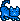

# How MoonCats Are Colorized - Inside the Hue-based Color Wheel


Let's start with the
Hue-based color wheel visual:


(Source: [The Hue-based Color Wheel; How MoonCats Are Colorized](https://old.reddit.com/r/MoonCatRescue/comments/m4h7lx/visual_of_the_huebased_color_whee_how_mooncats/))


Brooks Boyd (aka Midnight Lightning) writes:

> Under the hood, MoonCats are using an "HSV" color representation for
> the rendered cat image. The first component of "HSV" stands for
> "Hue", which goes from 0 to 360 degrees,
> since it represents the "color wheel",
> and mathematically, circles are often divided into 360 degrees.
>
> [...]
>
> MoonCats can either have a "standard" palette" or an "inverted
> palette", and for each of the colors above I put in an example of
> what a MoonCat would look like if they were exactly that hue, both
> "normal" (on the left) and "inverted" (on the right).


Now let's backup and start from the beginning
the colors of MoonCats are based on the random RGB (Red/Green/Blue) values that are encoded in the 5-byte id,
that is, byte 3 for r/red, byte 4 for g/green, byte 5 for b/blue.
Example:

``` ruby
id  = '0x00571281e7'
r = id[6,2]    # take 2 chars (starting at position 6 - that is, byte 3)
#=> "12"
g = id[8,2]    # take 2 chars (starting at position 8 - that is, byte 4)
#=> "81"
b = id[10,2]   # take 2 chars (starting at position 10 - that is, byte 5)
#=> "e7"
```

Or the rbg color as a hex string `#1281e7`.
Note:  "12", "81" or "e7 is a 8-bit hex string (use `hex` to convert to number from 0 to 255).

``` ruby
r.hex
#=> 18
g.hex
#=> 129
b.hex
#=> 231
```

Or the rbg color as a triplet `rgb(18,129,231)`.
This rgb triplet is the starting point
to derive the color palette.
The original forumla in [`mooncatparser.js`](https://github.com/ponderware/mooncatparser/blob/master/mooncatparser.js) reads:

``` js
function derivePalette(r, g, b, invert) {
  var hsl = RGBToHSL(r, g, b);

  var h = hsl[0];
  var s = hsl[1];
  var l = hsl[2];
  var hx = h % 360;
  var hy = (h + 320) % 360;

  var c1 = HSLToRGB(hx, 1, 0.1);
  if (invert) {
      var c4 = HSLToRGB(hx, 1, 0.2);
      var c5 = HSLToRGB(hx, 1, 0.45);
      var c2 = HSLToRGB(hx, 1, 0.7);
      var c3 = HSLToRGB(hy, 1, 0.8);
  } else {
      var c2 = HSLToRGB(hx, 1, 0.2);
      var c3 = HSLToRGB(hx, 1, 0.45);
      var c4 = HSLToRGB(hx, 1, 0.7);
      var c5 = HSLToRGB(hy, 1, 0.8);

  }

  return [
      null,
      RGBToHex(c1),
      RGBToHex(c2),
      RGBToHex(c3),
      RGBToHex(c4),
      RGBToHex(c5)
  ];
}
```

In step one - the rgb triplet gets converted to
the hsl (hue/saturation/lightness) color scheme.
Let's try:


``` ruby
hsl = Mooncats::Color.rgb_to_hsl( r.hex, g.hex, b.hex )
#=> [209, 0.855421686746988, 0.48823529411764705]

h = hsl[0]   #=> 209
s = hsl[1]   #=> 0.855421686746988
l = hsl[2]   #=> 0.48823529411764705

hx = h % 360
#=> 209
hy = (h + 320) % 360
#=> 169
```


Note: Only the fully-saturated version of the color
gets used - that is, s/saturation and l/lightness
get dropped / not used.
`hx` (e.g. `209`)
is the hue-based color (see color wheel above)
which goes from 0 to 360 degrees.


In step two - the five colors get derived (calculated)
from `hx` and `hy`.

``` ruby
c1 = Mooncats::Color.from_hsl( hx, 1, 0.1 )
c2 = Mooncats::Color.from_hsl( hx, 1, 0.2 )
c3 = Mooncats::Color.from_hsl( hx, 1, 0.45 )
c4 = Mooncats::Color.from_hsl( hx, 1, 0.7 )
c5 = Mooncats::Color.from_hsl( hy, 1, 0.8 )
```

Note: If the "invert" flag is set than you get a version where a lighter version of the color is the dominant color of the cat e.g.
color 2 is color 4, 3 is 5, 4 is  2,
and 5 is 3. Example:

``` ruby
c1 = Mooncats::Color.from_hsl( hx, 1, 0.1 )
c4 = Mooncats::Color.from_hsl( hx, 1, 0.2 )
c5 = Mooncats::Color.from_hsl( hx, 1, 0.45 )
c2 = Mooncats::Color.from_hsl( hx, 1, 0.7 )
c3 = Mooncats::Color.from_hsl( hy, 1, 0.8 )
```

That's all the magic. For easy (re)use
you can use the pre-packaged `derive_palette` method.
Example:

``` ruby
normal   = Mooncats::Image.derive_palette( r: r.hex,
                                           g: g.hex,
                                           b: b.hex )
inverted = Mooncats::Image.derive_palette( r: r.hex,
                                           g: g.hex,
                                           b: b.hex,
                                           invert: true )
```

Show me the colors!  Let's use the color palettes and
generate some mooncats.
Let's use design #87 (in hex '57') or in English it's Right·Frown (Look Down)·Striped·Stalking.


``` ruby
cat = Mooncats::Image.new( design: 87, colors: normal )
cat.save( "i/colors-209_087.png")

cat = Mooncats::Image.new( design: 87, colors: inverted )
cat.save( "i/colors-209i_087.png")
```

And voila!




Bonus:  What Color is the Mooncat?

Let's use the names from the color wheel above
to get the color name in English
(using a 30 degree slice for each). Example:

``` ruby
def hue_to_color( hue )
   case hue
   when   0..29  then 'Red'
   when  30..59  then 'Orange'
   when  60..89  then 'Yellow'
   when  90..119 then 'Chartreuse'
   when 120..149 then 'Green'
   when 150..179 then 'Lime Green'
   when 180..209 then 'Cyan'
   when 210..239 then 'Sky Blue'
   when 240..269 then 'Blue'
   when 270..299 then 'Purple'
   when 300..329 then 'Magenta'
   when 330..359 then 'Fuscia'
   end
end
```

And let's try with `209`:

``` ruby
hue_to_color( 209 )
#=> "Cyan"
```

Or let's start from the beginning with the id `0x00571281e7`
and let's use the pre-packaged `Metadata` class
for the lookup. Example:

``` ruby
metadata = Mooncats::Metadata.new( '0x00571281e7' )
metadata.hue
#=> 209
metadata.color
#=> "Cyan"
```


Aside:  What name for the color halfway between "Yellow" and "Green"?

Brooks Boyd (aka Midnight Lightning) writes:

> "Orange" being a color halfway between "Red" and "Yellow" is pretty
> well-established, but halfway between "Yellow" and "Green" there's
> plenty of other color names, and different preferences
> on when people stop calling the color "yellow" and start calling it
> "green" (take a look at [the color quix that XKCD did a while ago](https://blog.xkcd.com/2010/05/03/color-survey-results/)
> for more on this, and especially note how big the region people
> called "green" is compared to how big the "yellow" region is).
> I've given all those other "halfway" colors arbitrary names here
> to at least get some common nomenclature for labeling them.


Aside II:  Cyan?! Between 180-209 degrees or 165-194 degrees?

Brooks Boyd (aka Midnight Lightning) writes:

> Note, this [hue-based color wheel] visual shows that my initial assessment of classifying
> colors doesn't really match human perception that well.
> I gave each of these 12 colors 30 degrees of the circle,
> which is a good, even distribution, but I started the color
> range at the "true" color's degrees,
> rather than centering the "true" color in the range
> (I had 180-209 degrees as "Cyan", when really,
> the human eye would likely call things in the 165-194 degrees range
> "Cyan"). So, the boundaries of which "color" a cat is should probably
> be shifted 15 degrees down (counter-clockwise)
> to better match what a human might call that color just eyeballing it.
