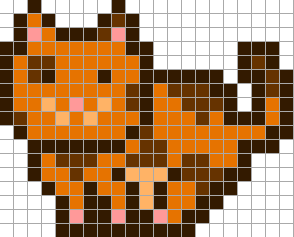
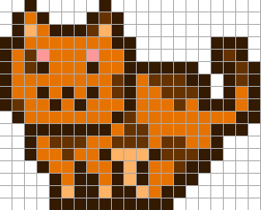

# Draw Your Own MoonCat (or Garfield) Designs Using the Original Online Pixel Drawing Tool


The Mooncat developers (Ponderware) write:

> Here is the tool we wrote and used to generate the MoonCatRescue pixel art.
> There has been some interest in knowing how we drew them, so we figured we might as well release it.
> Prepare to be underwhelmed!  => [**mooncatrescue.com/pixeleditor**](https://mooncatrescue.com/pixeleditor)


Let's try it out online - there are [128 original mooncat pixel drawings / designs](https://github.com/cryptocopycats/awesome-mooncatrescue-bubble/blob/master/DESIGNS.md)
(all encoded in the original source code in a single-line string - see [`designs.rb`](https://raw.githubusercontent.com/cryptocopycats/mooncats/master/mooncats/lib/mooncats/designs.rb) for a "word-wrapped" more readable
source of the original example.

Yes, you can read in the design into the pixel drawing tool online  (reformat required - every pixel row must be on its own line
and all (color) numbers space separated).
Example for [design 0](https://github.com/cryptocopycats/design.mooncats/blob/master/original/000.txt):

```
0 0 1 0 0 0 0 0 1 0 0 0 0 0 0 0 0 0 0 0 0
0 1 3 1 0 0 0 1 3 1 0 0 0 0 0 0 0 0 0 0 0
0 1 5 3 1 1 1 3 5 1 0 0 0 0 0 0 0 0 0 0 0
1 1 3 3 3 3 3 3 3 1 1 0 0 0 0 0 0 1 1 1 0
1 3 3 3 3 3 3 3 3 3 1 0 0 0 0 0 0 1 3 1 0
1 3 3 1 3 3 3 1 3 3 1 1 1 1 1 1 0 1 1 3 1
1 3 3 3 3 3 3 3 3 3 1 3 3 3 3 1 1 0 1 3 1
1 3 3 4 3 5 3 4 3 3 1 3 3 3 3 3 1 0 1 3 1
1 3 3 3 4 3 4 3 3 3 1 3 3 3 3 3 1 1 1 3 1
0 1 3 3 3 3 3 3 3 1 3 3 3 3 3 3 3 3 3 1 1
0 0 1 1 1 1 1 1 1 3 3 3 3 3 3 3 3 1 1 1 0
0 0 1 3 3 3 3 3 3 3 3 3 3 3 3 3 3 1 0 0 0
0 0 1 3 3 3 3 3 1 4 4 4 1 3 3 3 1 1 0 0 0
0 0 0 1 3 3 1 3 3 1 4 1 3 3 3 1 1 0 0 0 0
0 0 0 0 1 3 1 1 3 1 4 1 3 3 1 1 0 0 0 0 0
0 0 0 0 1 5 1 1 5 1 1 5 3 1 1 0 0 0 0 0 0
0 0 0 0 1 1 1 1 1 1 1 1 1 1 0 0 0 0 0 0 0
```

Paste the text into the box below the pixel grid canvas and click on the read button.
Now you should see the mooncat pixel design.


Yes, you can mint yourself
MoonCats from the "raw" format.
Let's try using the default Garfield-themed
colors from the Pixel Drawing Tool
and the design #0:


``` ruby
require 'mooncats'

colors = ['331a00', '663300', 'e67300', 'ffb366', 'ff9999' ]
design =  Mooncats::Design.parse( <<TXT )
0 0 1 0 0 0 0 0 1 0 0 0 0 0 0 0 0 0 0 0 0
0 1 3 1 0 0 0 1 3 1 0 0 0 0 0 0 0 0 0 0 0
0 1 5 3 1 1 1 3 5 1 0 0 0 0 0 0 0 0 0 0 0
1 1 3 3 3 3 3 3 3 1 1 0 0 0 0 0 0 1 1 1 0
1 3 3 3 3 3 3 3 3 3 1 0 0 0 0 0 0 1 3 1 0
1 3 3 1 3 3 3 1 3 3 1 1 1 1 1 1 0 1 1 3 1
1 3 3 3 3 3 3 3 3 3 1 3 3 3 3 1 1 0 1 3 1
1 3 3 4 3 5 3 4 3 3 1 3 3 3 3 3 1 0 1 3 1
1 3 3 3 4 3 4 3 3 3 1 3 3 3 3 3 1 1 1 3 1
0 1 3 3 3 3 3 3 3 1 3 3 3 3 3 3 3 3 3 1 1
0 0 1 1 1 1 1 1 1 3 3 3 3 3 3 3 3 1 1 1 0
0 0 1 3 3 3 3 3 3 3 3 3 3 3 3 3 3 1 0 0 0
0 0 1 3 3 3 3 3 1 4 4 4 1 3 3 3 1 1 0 0 0
0 0 0 1 3 3 1 3 3 1 4 1 3 3 3 1 1 0 0 0 0
0 0 0 0 1 3 1 1 3 1 4 1 3 3 1 1 0 0 0 0 0
0 0 0 0 1 5 1 1 5 1 1 5 3 1 1 0 0 0 0 0 0
0 0 0 0 1 1 1 1 1 1 1 1 1 1 0 0 0 0 0 0 0
TXT

cat = Mooncats::Image.new( design: design, colors: colors )
cat.save( './garfield-000.png' )
cat.zoom(4).save( './garfield-000x4.png' )
```

Resulting in:


Yes, you can turn any design into the "raw" format
for easy cut-n-paste using the `Design#to_txt` method.
Let's remake design 8 (Standing Smiling Spotted Left).

``` ruby
design = Mooncats::Design.find( 8 )
design.to_txt
```

Resulting in:

```
0 0 1 0 0 0 0 0 1 0 0 0 0 0 0 0 0 0 0 0 0
0 1 3 1 0 0 0 1 2 1 0 0 0 0 0 0 0 0 0 0 0
0 1 5 3 1 1 1 2 5 1 0 0 0 0 0 0 0 0 0 0 0
1 1 3 3 3 3 3 3 3 1 1 0 0 0 0 0 0 1 1 1 0
1 3 2 2 3 3 3 3 3 3 1 0 0 0 0 0 0 1 2 1 0
1 3 2 1 3 3 3 1 3 3 1 1 1 1 1 1 0 1 1 2 1
1 3 3 3 3 3 3 3 3 2 1 3 2 2 2 1 1 0 1 2 1
1 3 3 4 3 5 3 4 3 2 1 3 3 2 2 2 1 0 1 3 1
1 2 3 3 4 3 4 3 3 3 1 3 3 3 2 3 1 1 1 3 1
0 1 3 3 3 3 3 3 3 1 2 3 3 3 3 3 3 3 3 1 1
0 0 1 1 1 1 1 1 1 3 2 2 3 3 3 3 3 1 1 1 0
0 0 1 3 2 2 2 3 3 2 2 2 3 2 2 3 3 1 0 0 0
0 0 1 3 3 2 3 3 1 4 4 4 1 2 2 2 1 1 0 0 0
0 0 0 1 3 3 1 3 3 1 4 1 3 3 2 1 1 0 0 0 0
0 0 0 0 1 3 1 1 3 1 4 1 3 3 1 1 0 0 0 0 0
0 0 0 0 1 5 1 1 5 1 1 5 3 1 1 0 0 0 0 0 0
0 0 0 0 1 1 1 1 1 1 1 1 1 1 0 0 0 0 0 0 0
```

Paste the text into the box below the pixel grid canvas and click on the read button.
Now you should see the mooncat pixel design #8 (Standing Smiling Spotted Left).





Let's change the nose and mouth to use the outline (color #1).
Let's change color #5 into the (exclusive) eyes color
by adding a pixel each to the eyes
and changing all other color #5 pixels to color #4.
Can you see the difference?




Let's use the new design. Click on the print button
to get an up-to-date copy to cut-n-paste:

```
design =  Mooncats::Design.parse( <<TXT )
0 0 1 0 0 0 0 0 1 0 0 0 0 0 0 0 0 0 0 0 0
0 1 3 1 0 0 0 1 2 1 0 0 0 0 0 0 0 0 0 0 0
0 1 4 3 1 1 1 2 4 1 0 0 0 0 0 0 0 0 0 0 0
1 1 3 3 3 3 3 3 3 1 1 0 0 0 0 0 0 1 1 1 0
1 3 2 5 3 3 3 5 3 3 1 0 0 0 0 0 0 1 2 1 0
1 3 2 1 3 3 3 1 3 3 1 1 1 1 1 1 0 1 1 2 1
1 3 3 3 3 3 3 3 3 2 1 3 2 2 2 1 1 0 1 2 1
1 3 3 1 3 1 3 1 3 2 1 3 3 2 2 2 1 0 1 3 1
1 2 3 3 1 3 1 3 3 3 1 3 3 3 2 3 1 1 1 3 1
0 1 3 3 3 3 3 3 3 1 2 3 3 3 3 3 3 3 3 1 1
0 0 1 1 1 1 1 1 1 3 2 2 3 3 3 3 3 1 1 1 0
0 0 1 3 2 2 2 3 3 2 2 2 3 2 2 3 3 1 0 0 0
0 0 1 3 3 2 3 3 1 4 4 4 1 2 2 2 1 1 0 0 0
0 0 0 1 3 3 1 3 3 1 4 1 3 3 2 1 1 0 0 0 0
0 0 0 0 1 3 1 1 3 1 4 1 3 3 1 1 0 0 0 0 0
0 0 0 0 1 4 1 1 4 1 1 4 3 1 1 0 0 0 0 0 0
0 0 0 0 1 1 1 1 1 1 1 1 1 1 0 0 0 0 0 0 0
TXT

cat = Mooncats::Image.new( design: design, colors: colors )
cat.save( './garfield-008v2.png' )
cat.zoom(4).save( './garfield-008v2x4.png' )
```

Voila!


What's the point?
It's "L'art pour L'art" or in English "Art for Art's Sake" :-).

Almost. The idea of the new design is to make
it easier to colorize Mooncats. The new color scheme:

- #1 - outline color
- #2 - pattern 1 (or highlight) color
- #3 - base color
- #4 - pattern 2 (or accent) color
- #5 - eyes color

Let's try:


And for some more fun here's the [design 3](original/003.txt) reformatted - ready to copy'n'paste:

```
0 0 0 0 0 0 0 0 0 0 1 1 1 1 1 1 0 0 0 0
0 0 0 0 0 0 0 0 0 0 1 3 3 3 3 1 1 1 0 0
0 0 0 0 0 0 0 0 0 0 1 3 1 1 3 3 3 1 0 0
0 0 0 0 0 0 0 0 0 0 1 1 0 0 1 1 3 1 0 0
0 0 0 0 0 0 0 0 0 0 0 0 0 0 0 1 3 1 1 0
0 0 0 0 0 0 0 0 0 0 0 0 0 0 0 1 3 3 1 0
0 0 1 1 0 0 0 0 1 1 0 0 0 1 1 1 1 1 1 0
0 1 3 1 0 0 0 1 3 1 0 0 1 1 3 3 3 3 1 1
1 3 5 3 1 1 1 3 5 3 1 1 1 3 3 3 3 3 3 1
1 3 3 3 3 3 3 3 3 3 1 1 3 3 3 3 3 3 3 1
1 3 3 3 3 3 3 3 3 3 1 3 3 3 3 3 3 3 3 1
1 3 3 1 3 3 3 1 3 3 1 3 3 3 3 3 3 3 1 1
1 3 3 3 3 3 3 3 3 3 1 3 3 3 3 3 3 3 1 0
1 3 3 4 3 5 3 4 3 3 1 3 3 3 3 4 3 3 1 0
1 3 3 3 4 3 4 3 3 3 1 3 3 4 4 4 3 3 1 0
0 1 3 3 3 3 3 3 3 1 1 3 4 4 4 1 3 3 3 1
0 0 1 1 1 1 1 1 1 3 3 3 1 1 1 1 1 3 3 1
0 1 1 3 3 3 3 3 3 3 1 1 1 3 3 1 1 3 1 1
1 1 3 3 3 1 3 3 1 1 1 1 5 3 1 1 3 3 1 0
1 5 3 1 1 1 5 1 1 0 0 1 1 1 1 5 3 1 1 0
1 1 1 1 0 1 1 1 0 0 0 0 0 0 1 1 1 1 0 0
```


